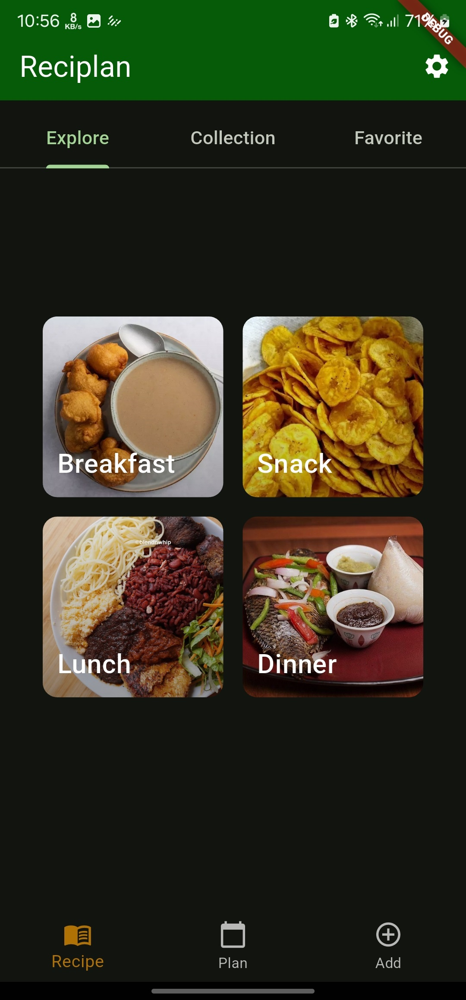
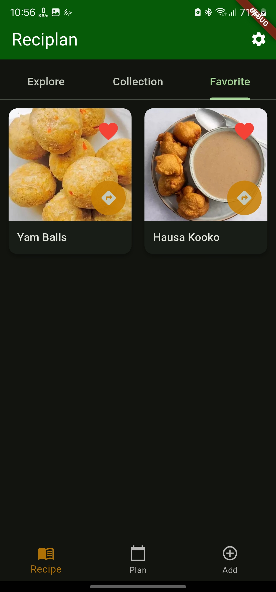
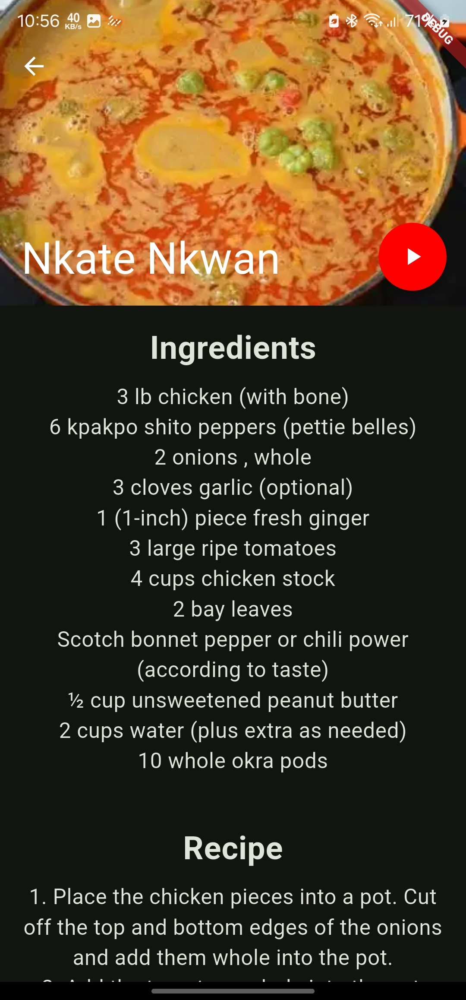
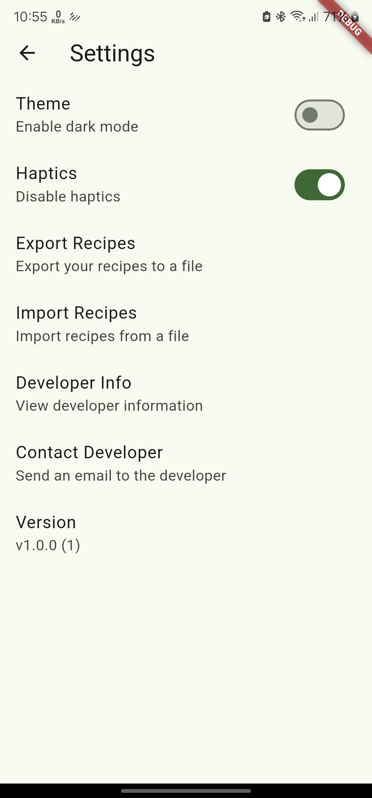

# Reciplan3

Reciplan3 is an offline-first flutter android first to help you discover and prepare delicious Ghanaian dishes.
Reciplan3 provides everything you need to explore the rich flavors and traditions of Ghanaian cuisine.
The codebase is simple to facilitate easy understanding by beginners.

## Table of contents

1. [Demo](#demo)
2. [Screenshots](#screenshots)
3. [Tech Stack](#tech-stack)
4. [Features](#features)
5. [Development Setup](#development-setup)
6. [License](#license)

## Demo

https://github.com/keeghan/MovieSearch/assets/40280581/fb75ae08-1c01-462a-ba55-b79cf039d156

## Screenshots

 &nbsp;  &nbsp;  &nbsp;  

## Tech Stack

- [Dart](https://dart.dev/) as the programming language.
- [Flutter](https://flutter.dev/) for building cross-platform applications.
- [Provider](https://pub.dev/packages/provider) for state management.
- [GetIt](https://pub.dev/packages/get_it) for service locator and dependency injection.
- [Floor](https://pub.dev/packages/floor) for local database management, similar to Room in Android.
- [json_annotation](https://pub.dev/packages/json_annotation) for JSON serialization, replacing Kotlinx Serialization.
- [Cached Network Image](https://pub.dev/packages/cached_network_image) for loading and caching images, similar to Glide.
- [url_launcher](https://pub.dev/packages/url_launcher) for launching URLs and deep linking.
- [shared_preferences](https://pub.dev/packages/shared_preferences) for storing simple key-value pairs, similar to Android's Preference.
- [file_picker](https://pub.dev/packages/file_picker) for picking files, replacing any file selection libraries like uCrop.
- [permission_handler](https://pub.dev/packages/permission_handler) for handling permissions.
- [path_provider](https://pub.dev/packages/path_provider) for accessing commonly used locations on the device’s filesystem.

## Features

- Design a weekly meal plan
- Add, Edit and Remove a collection of Ghanaian recipes
- Export and Import local recipes as Json files.
- Support for dark theme

## Development Setup

Make sure you have downloaded and set up Flutter and Android Studio correctly before you begin working on this project. Ensure that you have the Flutter SDK installed and the necessary Flutter dependencies are set up. Here is the official Flutter documentation to guide you through the installation and setup process:

- [Flutter Installation](https://flutter.dev/docs/get-started/install)

Additionally, ensure that Android Studio is configured with the Flutter and Dart plugins. This will allow you to develop, build, and test Flutter applications effectively. You can follow the guide below to set up Android Studio for Flutter:

- [Android Studio Setup for Flutter](https://flutter.dev/docs/get-started/editor?tab=androidstudio)

## License

This project is currently licensed under the Creative Commons Legal Code : CC0 1.0 Universal

