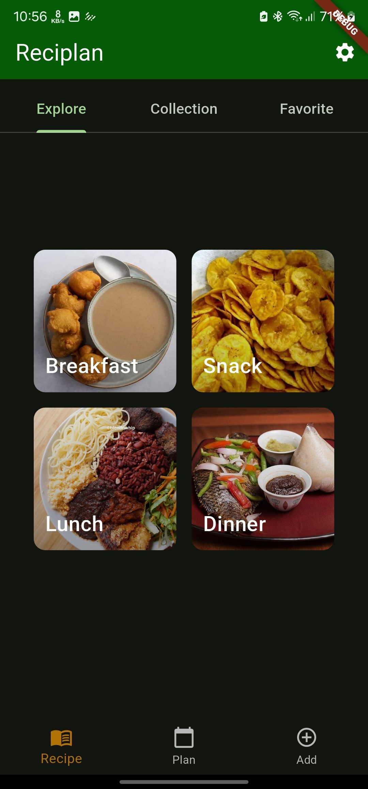
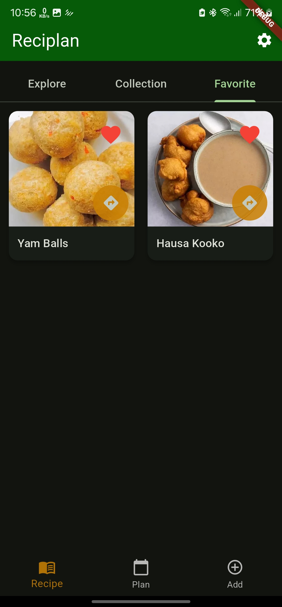
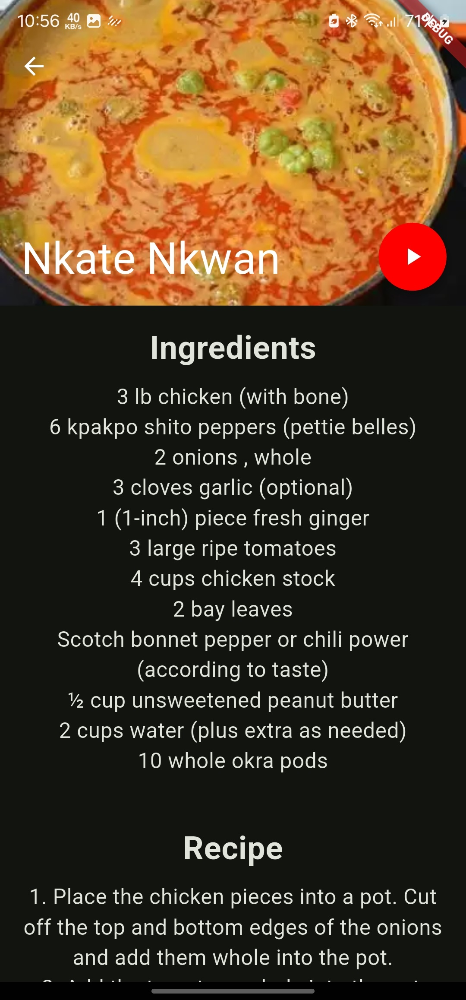
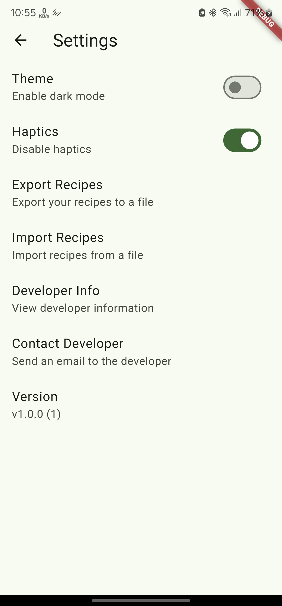

# Reciplan3

Reciplan3 is an offline-first Flutter app for exploring Ghanaian recipes and building a simple weekly meal plan.

The app stores data locally with SQLite via Floor and now uses a `flutter_bloc`-based architecture with business logic grouped under `lib/logic` and UI grouped under `lib/presentation`.

For more detail on the recent architecture rewrite, see [MIGRATION.md](/Users/eghan/StudioProjects/reciplan3/MIGRATION.md).

## Table of Contents

1. [Screenshots](#screenshots)
2. [Tech Stack](#tech-stack)
3. [Features](#features)
4. [Project Structure](#project-structure)
5. [Development Setup](#development-setup)
6. [License](#license)

## Screenshots

 &nbsp;  &nbsp;  &nbsp; 

## Tech Stack

- [Dart](https://dart.dev/)
- [Flutter](https://flutter.dev/)
- [flutter_bloc](https://pub.dev/packages/flutter_bloc)
- [equatable](https://pub.dev/packages/equatable)
- [Floor](https://pub.dev/packages/floor)
- [sqflite](https://pub.dev/packages/sqflite)
- [shared_preferences](https://pub.dev/packages/shared_preferences)
- [file_picker](https://pub.dev/packages/file_picker)
- [path_provider](https://pub.dev/packages/path_provider)
- [cached_network_image](https://pub.dev/packages/cached_network_image)
- [url_launcher](https://pub.dev/packages/url_launcher)

## Features

- Explore Ghanaian recipes by meal type
- Maintain a personal recipe collection
- Mark recipes as favorites
- Build a weekly meal plan
- Import and export local recipes as JSON
- Persist theme and app settings locally

## Project Structure

```text
lib/
  logic/         # app wiring, cubits, repositories, data, shared models
  presentation/  # feature screens and shared widgets
  util/          # remaining shared helpers/utilities
```

Feature screens live directly under `lib/presentation/features/<feature>`, and business logic is grouped under `lib/logic`.

## Development Setup

1. Install Flutter and verify it is available on your machine.
2. Run `flutter pub get`.
3. Run `flutter analyze`.
4. Run `flutter test`.
5. Start the app with `flutter run`.

Helpful references:

- [Flutter install guide](https://docs.flutter.dev/get-started/install)
- [Set up an editor](https://docs.flutter.dev/get-started/editor)

## License

This project is licensed under the Creative Commons Legal Code: CC0 1.0 Universal.
